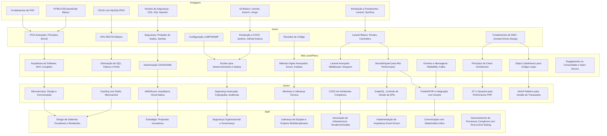

```mermaid

graph TB

    %% Definindo os nós do roadmap de carreira com mais detalhes
    subgraph Estagiario
        A1[Fundamentos de PHP]
        A2[HTML/CSS/JavaScript Básico]
        A3[CRUD com MySQLi/PDO]
        A4[Nocões de Segurança - XSS, SQL Injection]
        A5[Git Básico: commit, branch, merge]
        A6[Introdução a Frameworks: Laravel, Symfony]
    end

    subgraph Junior
        B1[POO Avançado, Princípios SOLID]
        B2[APIs RESTful Básico]
        B3[Segurança: Proteção de Dados, Senhas]
        B4[Configuração LAMP/WAMP]
        B5[Introdução a CI/CD: Jenkins, GitHub Actions]
        B6[Revisões de Código]
        B7[Laravel Básico: Routes, Controllers]
        B8[Fundamentos de DDD - Domain-Driven Design]
    end

    subgraph Mid-Level/Pleno
        C1[Arquitetura de Software, MVC Completo]
        C2[Otimização de SQL, Índices e Perfis]
        C3[Autenticação OAuth/SAML]
        C4[Docker para Desenvolvimento e Deploy]
        C5[Métodos Ágeis Avançados: Scrum, Kanban]
        C6[Laravel Avançado: Middleware, Eloquent]
        C7[Swoole/Hyperf para Alta Performance]
        C8[Eventos e Mensageria: RabbitMQ, Kafka]
        C9[Princípios de Clean Architecture]
        C10[Object Calisthenics para Código Limpo]
        C11[Engajamento na Comunidade e Open Source]
    end

    subgraph Senior
        D1[Microserviços: Design e Comunicação]
        D2[Caching com Redis, Memcached]
        D3[AWS/Azure, Arquitetura Cloud-Nativa]
        D4[Segurança Avançada: Criptografia, Auditorias]
        D5[Mentoria e Liderança Técnica]
        D6[CI/CD em Ambientes Complexos]
        D7[GraphQL, Controle de Versão de APIs]
        D8[FranklinPHP e Integração com Swoole]
        D9[JIT e Opcache para Performance PHP]
        D10[SAGA Patterns para Gestão de Transações]
    end

    subgraph Staff
        E1[Design de Sistemas Escaláveis e Resilientes]
        E2[Segurança Organizacional e Governança]
        E3[Estratégia: Propostas Inovadoras]
        E4[Liderança de Equipes e Projetos Multidisciplinares]
        E5[Automação de Infraestrutura: Terraform/Ansible]
        E6[Comunicação com Stakeholders Altos]
        E8[Implementação de Arquitetura Event-Driven]
        E9[Gerenciamento de Processos Complexos com End-to-End Testing]
    end

    %% Ligação entre os níveis em um roadmap
    A1 --> B1
    A2 --> B1
    A3 --> B2
    A4 --> B3
    A5 --> B5
    A6 --> B7
    B1 --> C1
    B2 --> C2
    B3 --> C3
    B4 --> C4
    B5 --> C4
    B6 --> C5
    B7 --> C6
    B7 --> C7
    B8 --> C9
    B8 --> C10
    C1 --> D1
    C2 --> D2
    C3 --> D3
    C4 --> D4
    C5 --> D5
    C7 --> D7
    C7 --> D8
    C8 --> D8
    C9 --> D9
    C10 --> D10
    D1 --> E1
    D2 --> E1
    D3 --> E3
    D4 --> E2
    D5 --> E4
    D6 --> E5
    D7 --> E8
    D8 --> E6


```